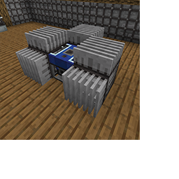

---
navigation:
  title: "Heat Pipe"
  icon: "pneumaticcraft:heat_pipe"
  parent: pneumaticcraft:machines.md
item_ids:
  - pneumaticcraft:heat_pipe
---

# Heat Pipe

The *Heat Pipe* is an insulated core of compressed iron which can transmit heat between blocks, without any thermal connection to adjacent air or fluid blocks. It's a more compact (and cheaper) alternative to using *Compressed Iron Blocks* to transmit heat.

You can conceal Heat Pipes with the [Camouflage Applicator](../camo_applicator.md).

*TODO: heat pipe image*

TODO: Unsupported flag 'border'

Crafting a Heat Pipe

<Recipe id="pneumaticcraft:heat_pipe" />

