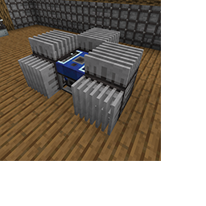

---
navigation:
  title: "Heat Sink"
  icon: "pneumaticcraft:heat_sink"
  parent: pneumaticcraft:machines.md
item_ids:
  - pneumaticcraft:heat_sink
---

# Heat Sink

The *Heat Sink* is a block used to get rid of [Heat](../heat.md).

Be careful, a *Heat Sink* hotter than 60°C or colder than -60°C will hurt you when touched!

*Heat Sinks* only dissipate heat from the block they're directly connected to. To connect up many *Heat Sinks*, use [Heat Pipes](./heat_pipe.md) to provide more surfaces.

*An [Advanced Liquid Compressor](../advanced_liquid_compressor.md)* *with multiple Heat Sinks*

TODO: Unsupported flag 'border'

## Active Cooling

You can increase the effectiveness of a *Heat Sink* by placing it in range of an [Air Grate Module](../air_grate_module.md#active_cooling). The module's range is displayed when you attach it to a [Pressure Tube](../pressure_tubes.md). The cooling effectiveness can be stacked by using multiple Air Grate Modules.

Crafting a Heat Sink

<Recipe id="pneumaticcraft:heat_sink" />

