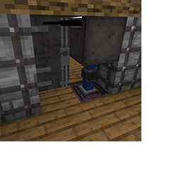

---
navigation:
  title: "Pneumatic Door"
  icon: "pneumaticcraft:pneumatic_door"
  parent: pneumaticcraft:machines.md
item_ids:
  - pneumaticcraft:pneumatic_door
  - pneumaticcraft:pneumatic_door_base
---

# Pneumatic Door

This special door will open automatically if there is a player nearby, provided that it has sufficient [air pressure](../base_concepts/pressure.md). It has a base detection range of 2 blocks but this can be increased by inserting [Range Upgrades](../base_concepts/upgrades.md#range).

To construct a *Pneumatic Door*, you must place a *Pneumatic Door Base* so that it's level with the *top half* of the door itself.

*A double Pneumatic Door; left side is [camouflaged](../tools/camo_applicator.md)**, right side is not*

<ItemImage id="pneumaticcraft:security_station" />

When the *Pneumatic Door Base* is within the range of an operating [Security Station](./security_station.md), it will only open the door to players trusted by the *Security Station*.

## Operating Modes

The *Pneumatic Door* operates in one of three modes, selectable via the door base GUI:
- *Player Nearby*: the door will open when a player is in range.
- *Nearby and Looking*: the door will open when a player is nearby *and* looking at the door
- *Wooden Door*: the door behaves like a vanilla *Wooden Door*.

<Recipe id="pneumaticcraft:pneumatic_door" />

<Recipe id="pneumaticcraft:pneumatic_door_base" />

