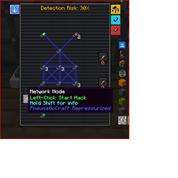

---
navigation:
  title: "Security Station"
  icon: "pneumaticcraft:security_station"
  parent: pneumaticcraft:machines.md
item_ids:
  - pneumaticcraft:security_station
---

# Security Station

If you want to protect an area from hostile players, you can use the *Security Station*.

This device prevents all player interaction by untrusted players on any blocks within its range. This means that no inventories or GUIs can be opened, and no blocks can be placed or broken.

<ItemImage id="pneumaticcraft:security_station" />

This sounds great, but to set up a *Security Station* you need to do some things to ensure its security. Because the thing is, *Security Stations* can be [hacked](#hacking). The hacking system of the Security Station is heavily inspired by [Deus Ex: Revolution's hacking system](https://www.youtube.com/watch?v=nQ0rPLlU8v4).

## Setup

To set up a *Security Station*, you must place [Network Components](../components/network_components.md) in the network grid to form a *network*. In every network there must be one [Diagnostic Subroutine](../components/network_components.md#diagnostic), one [Network IO Port](../components/network_components.md#io_port), and one [Network Registry](../components/network_components.md#registry).

These three special nodes must all be connected with each other, which is done with [Network Nodes](../components/network_components.md#node).

## Hacking Disabled

Security Station hacking has been disabled by config on this server. While this means that no player can hack your Security Station once set up, it is still necessary to set it up with the correct components, as described on the previous page. However most of the following pages (other than *Allowing Friends*) do not apply here.

## Rules

The [hacker](#hacking) starts at the *Network IO Port*, and has the goal of capturing either the *Diagnostic Subroutine* or the *Network Registry*.

The *Diagnostic Subroutine* has the goal of tracing back to the hacker's entry point at the *Network IO Port*.

Placing *Network Node* components in larger stacks increases the *node rating*, meaning it takes longer for both the *hacker* and the *Diagnostic* to capture them. But note that since the *Diagnostic* can trace faster than the *hacker* can, this is more of a disadvantage to the hacker than it is to the Diagnostic.

## Hacker Tools

There are a couple of useful items that hackers should try to obtain; neither are craftable and must be found in-world (villager trades or dungeon loot):
- The [Nuke Virus](../components/nuke_virus.md), which can be used to insta-capture one node
- The [STOP! Worm](../components/stop_worm.md), which can temporarily freeze a Diagnostic's trace progress.

## Upgrades

The *Security Station* takes a few upgrades:
- [Entity Trackers](../base_concepts/upgrades.md#entity_tracker) increase the chance for the [hacker](#hacking) to be detected; there are diminishing returns, and the maximum protection is 99% per node hack attempt.
- [Range Upgrades](../base_concepts/upgrades.md#range) increase the protected range of the station by 1 per upgrade, to a maximum of 16 blocks in every direction (for a max protected area of 33x33x33 blocks).

## Upgrades (cont.)

- [Security Upgrades](../base_concepts/upgrades.md#security) increase the number of *Security Upgrades* that hackers need in their [Pneumatic Helmet](../armor/pneumatic_helmet.md) to start hacking. Note that hackers won't be told how many Security Upgrades they need, and the Security Station will deal a small amount of non-resistible damage to any player who tries to hack, but can't due to lack of Security Upgrades.

## Allowing Friends

You can add friendly players to your *Security Station* to allow them to interact within the protected area; use the **Shared Users** side tab to enter player names.

You can remove no-longer-trusted players here too; just click the player's name to remove it.

## Getting Hacked

When someone hacks your *Security Station*, you can see that in the **Problems** and **Status** tabs, where it also shows *who* has hacked your system. These players (and only these players) can now interact with blocks within the area. To restore security, you'll have to *reboot* the *Security Station* via the **Reboot** button in the GUI. The reboot process takes 60 seconds, during which time the area isn't secured at all.

## Hacking

To hack a *Security Station* that isn't yours, you need a [Pneumatic Helmet](../armor/pneumatic_helmet.md) with at least one (and probably many) [Security Upgrades](../base_concepts/upgrades.md#security) installed. When you do this, a GUI similar to the one opposite appears. Watch [this video (very old but still relevant)](https://www.youtube.com/watch?v=Lgmpslbrrwo) for a guide on how to hack.

To capture a node, *left-click* it. To fortify a captured node, *right-click* it; fortified nodes take slightly longer for the Diagnostic to capture.

## Tips

- Keep your *Security Station* well-concealed and well-protected.
- You can protect an area with multiple *Security Stations*; all of them must be hacked.
- Consider active defences, such as [Drones](../tools/drone.md) with combat programs, or [Sentry Turrets](./sentry_turret.md)
- A hacked *Security Station* can be made to emit a <Color hex="#f00">redstone signal</Color>, which could trigger additional measures (TNT under the station, perhaps?)

Crafting a Security Station

<Recipe id="pneumaticcraft:security_station" />

