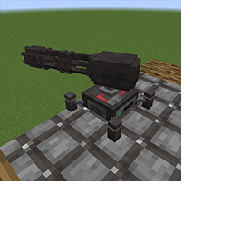

---
navigation:
  title: "Sentry Turret"
  icon: "pneumaticcraft:sentry_turret"
  parent: pneumaticcraft:machines.md
item_ids:
  - pneumaticcraft:sentry_turret
---

# Sentry Turret

The *Sentry Turret* is an autonomous defensive weapon. It uses an integrated [Minigun](../tools/minigun.md) and [Gun Ammo](../tools/minigun_ammo.md) (which you must supply) to shoot entities within range. Its range is 16 blocks by default, but can be upgraded with [Range Upgrades](../base_concepts/upgrades.md#range) to a max of 32 blocks.

You do not need to provide [pressure](../base_concepts/pressure.md) for Sentry Turret to function, but you do need to provide [ammo](../tools/minigun_ammo.md).

<ItemImage id="pneumaticcraft:sentry_turret" />

Potential targets for the *Sentry Turret* can be filtered by entering an [Entity Filter](../base_concepts/entity_filter.md) in the Turret's GUI; you can press & hold *F1* for a popup filter help page.

Newly-placed turrets have a default filter of *@mob*, but a turret with no filter will not attack the player who placed it.

<ItemImage id="pneumaticcraft:security_station" />

When the *Sentry Turret* is covered by one or more [Security Stations](./security_station.md), it will never target any players who are on the trusted list of *all* Security Stations, regardless of how the entity filter is set up.

TODO: Unsupported flag 'border'

Crafting a Sentry Turret

<Recipe id="pneumaticcraft:sentry_turret" />

