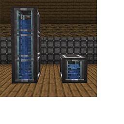

---
navigation:
  title: "Tanks"
  icon: "pneumaticcraft:small_tank"
  parent: pneumaticcraft:machines.md
item_ids:
  - pneumaticcraft:small_tank
  - pneumaticcraft:medium_tank
  - pneumaticcraft:large_tank
  - pneumaticcraft:huge_tank
---

# Tanks

There are four fluid storage tanks, imaginatively titled the *Small Tank*, the *Medium Tank*, the *Large Tank*, and the *Huge Tank*. While [Liquid Hoppers](./liquid_hopper.md) are also suitable for fluid storage, these tanks provide denser storage and some useful stacking functionality, and don't automatically transfer fluids (although they can push fluids if a [Dispenser Upgrade](../base_concepts/upgrades.md#dispenser)) is added.

## Stacking

All four types of tank can be *stacked* vertically with each other, and formed into a sort-of-multiblock. To do this, right-click the tank with a [Wrench](../tools/pneumatic_wrench.md); wrenching the top half will attempt to join the tank to the tank above, and vice versa for the tank below.

Once tanks are stacked, any fluid in <Color hex="#880">$(t:If the fluid has a density of < 0, it will move up rather than down)higher tanks$(/t:If the fluid has a density of < 0, it will move up rather than down)</Color> will automatically flow down to lower tanks, assuming there is space.

Three stacked Small Tanks

TODO: Unsupported flag 'border'

There are some restrictions to this:
- To combine two tanks, either both must contain the same fluid (or no fluid), or one of the tanks must be empty
- Fluid will *not* move upwards; therefore fluid should be pumped into the top tank of a stack, and pumped out of the bottom tank for best results
- The tank GUI will only show the fluid quantity of the tank that was right-clicked.

<Recipe id="pneumaticcraft:small_tank" />

<Recipe id="pneumaticcraft:medium_tank" />

<Recipe id="pneumaticcraft:large_tank" />

<Recipe id="pneumaticcraft:huge_tank" />

