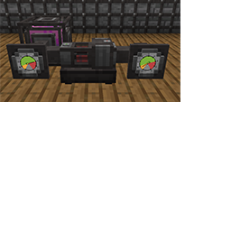

---
navigation:
  title: "Vacuum Pump"
  icon: "pneumaticcraft:vacuum_pump"
  parent: pneumaticcraft:machines.md
item_ids:
  - pneumaticcraft:vacuum_pump
---

# Vacuum Pump

The *Vacuum Pump* is a machine used to create... a vacuum. To do this the machine consumes [pressurized air](../pressure.md).

Positive pressure should be applied on the <Color hex="#0c0">'+' side</Color>; when the minimal working pressure is reached, the *Vacuum Pump* starts pumping and the pressure on the <Color hex="#c00">'-' side</Color> drops, to a minimum of -1.0 bar, which is a vacuum.




## Applications

The following uses exist for negative (vacuum) pressure:
- Disenchanting: place an *enchanted item* or *Enchanted Book* with more than one enchantment and a vanilla *Book* in a [Pressure Chamber](../pressure_chamber.md) and give the chamber sufficient negative pressure. A random enchantment will transfer from the item to the book.
- The [Air Grate Module](../air_grate_module.md), when given negative pressure, will attract entities to itself.

## Applications (cont.)


- Both the [Vacuum Trap](../vacuum_trap.md) and [Spawner Extractor](../spawner_extractor.md), devices required for making and using [Pressurized Spawners](../pressurized_spawner.md), need negative pressure to operate.

Crafting a Vacuum Pump

<Recipe id="pneumaticcraft:vacuum_pump" />

**TODO:** Unsupported Patchouli page type **pneumaticcraft:pressure_chamber**

```
{"type":"pneumaticcraft:pressure_chamber","header":"Vacuum Disenchanting","recipe":"pneumaticcraft:pressure_chamber/pressure_chamber_disenchanting"}
```

