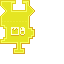

---
navigation:
  title: "Right Click Widget"
  icon: "pneumaticcraft:textures/progwidgets/block_right_click_piece.png"
  parent: pneumaticcraft:widget_interact.md
---

# Right Click Widget

The Drone will *right-click* with the item in its first inventory slot, for every block position in its connected [Area](./area.md) widget. This could be used to hoe the ground, place seeds, apply bonemeal, throw a potion, deploy a drone, rotate blocks with a wrench... the possibilities are endless.

This widget operates in one of two modes, selectable via the widget GUI in the Programmer:
- Item Mode - use the *held item's* right-click logic, e.g. use a *Flint & Steel* on some block
- Block Mode - activate the *block's* right-click logic, e.g. flip a *Lever*

In *Item Mode*, any attached filters apply to the *item* being used; in *Block Mode*, filters apply to the *block* being activated.

You could use this widget to place down regular blocks. However, this is *not* recommended, because when a Drone right-clicks a position where a block exists already, it will right-click the block, resulting in placing down a block *next* to this block instead of the block itself.

For these reasons the use of the [Place](./place.md) widget is preferred. There are some situations, though (e.g. trying to plant *Seeds*) where the *Right Click Block* widget is required.

*Right Click Widget*

