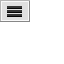

---
navigation:
  title: "Comment Widget"
  icon: "pneumaticcraft:textures/progwidgets/comment_piece.png"
  parent: pneumaticcraft:widget_other.md
---

# Comment Widget

This widget allows addition of *comments* to your program, and has no functional effect. It does not cost any [Puzzle Pieces](./puzzle_pieces.md) to use.

*Comment Widget*

