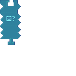

---
navigation:
  title: "Condition: Entity Widget"
  icon: "pneumaticcraft:textures/progwidgets/condition_entity_piece.png"
  parent: pneumaticcraft:widget_cond.md
---

# Condition: Entity Widget

This is a [Condition](./conditions.md) widget.

The *Condition: Entity* widget allows you to count entities in the connected [Area](./area.md) widget. These can be filtered by connecting an optional [Text](./text.md) widget used as an [Entity Filter](../base_concepts/entity_filter.md).

Keep in mind that any [Area](./area.md) widgets connected to this widget must have an area type of *Box*; this is the only supported shape. It's possible to create different shapes, though, by using whitelisting/blacklisting of areas.

*Condition: Entity Widget*

