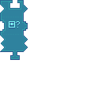

---
navigation:
  title: "Condition: Items Widget"
  icon: "pneumaticcraft:textures/progwidgets/condition_item_inventory_piece.png"
  parent: pneumaticcraft:widget_cond.md
---

# Condition: Items Widget

This is a [Condition](./conditions.md) widget.

The *Condition: Items* widget checks an inventory for a certain amount of items. It will count up all matching items (specified by a connected [Item Filter](./item_filter.md); omit the filter to count every item).

*Condition: Items Widget*

