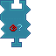

---
navigation:
  title: "Condition: Redstone Widget"
  icon: "pneumaticcraft:textures/progwidgets/condition_redstone_piece.png"
  parent: pneumaticcraft:widget_cond.md
---

# Condition: Redstone Widget

This is a [Condition](./conditions.md) widget.

The *Condition: Redstone* widget allows you to (remotely) check if the Redstone level of the block(s) in the connected [Area](./area.md) widget matches the configured Redstone threshold.

*Condition: Redstone Widget*

