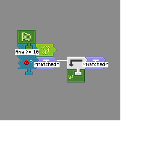

---
navigation:
  title: "Conditions"
  icon: "minecraft:comparator"
  parent: pneumaticcraft:programming.md
---

# Conditions

*Conditions* are a collection of widgets that allow you to check something, and jump to another part of your program if the check succeeds.

Every *Condition* widget takes a [Text](./text.md) widget parameter (which is always the bottom-most parameter) configured with a *label name*.

When a condition evaluates *true*, [program execution](./flow_control.md) will jump to a [Label](./label.md) widget with the same name as that *Text* parameter on its *right-hand* side. When the condition is *false*, it will jump to a *Label* with the same name as the *Text* parameter on its *left-hand side*.

When the *Condition* widget can't find a valid *Text* parameter, it will just proceed to the next widget (connected *below*).

*A Redstone Condition widget which kills the drone if the signal >= 10*

TODO: Unsupported flag 'border'

Most *Condition* widgets can be *right-clicked* to open a configuration GUI. The GUI will usually contain '='/'>=' options, and a textfield where you can enter a number.

With this you can set up conditions (like item counts in a chest) to be e.g. exactly 10 ('=' mode and textfield 10), more than 20 ('>=' mode and textfield '21'), or less than 12 ('>=' mode and textfield '12', but checking for the condition to be *false*).

## Measuring

All *Condition* widget GUI's (except [Condition: Item Filter](./condition_item.md)) have a *Measure* textfield, where you can enter the name of a [variable](./variables.md). If a variable name is supplied here, any measurement made by the drone will be stored in the X field of the variable.

This can then be later used like any other variable, e.g. you could measure the level of a fluid tank, and write it on a sign.

## Measuring (cont.)

If a measuring variable name is supplied, then it's no longer an error to have no branching Text widgets on the Condition widget (normally at least one branch is required). This means that the Condition widget can be used purely to measure a quantity; execution will just proceed downwards as normal.

Note: pressure measurement conditions store the measured pressure in millibars (e.g. 5.5 bars would be 5500).

## Condition Types

Conditions can be divided into two categories: *World Conditions* and *Drone Conditions*.

World Conditions are used to check for things in the world, e.g. does a *Chest* have a certain number of items, or does a block exist somewhere?

*Drone Conditions* specifically target the [Drone](../tools/drone.md), e.g. does the Drone have a certain item, or have a certain pressure?

All block-based *World Conditions* have an *Any/All* block option. This is used when you're checking multiple blocks at a time.
- In *Any* mode, only *one* of the blocks in the selected [area](./area.md) needs to match for the condition to be *true*.
- In *All* mode, *all* blocks must match for the condition to be *true*.

## World Conditions

- [TODO](./condition_block.md)
- [TODO](./condition_coordinate.md)
- [TODO](./condition_entity.md)
- [TODO](./condition_item.md)
- [TODO](./condition_item_inventory.md)
- [TODO](./condition_liquid_inventory.md)
- [TODO](./condition_pressure.md)
- [TODO](./condition_redstone.md)
- [TODO](./condition_rf.md)

## Drone Conditions

- [TODO](./drone_condition_item.md)
- [TODO](./drone_condition_liquid.md)
- [TODO](./drone_condition_entity.md)
- [TODO](./drone_condition_pressure.md)
- [TODO](./drone_condition_rf.md)

