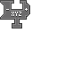

---
navigation:
  title: "Coordinate Operator Widget"
  icon: "pneumaticcraft:textures/progwidgets/coordinate_operation_plus_minus.png"
  parent: pneumaticcraft:widget_other.md
---

# Coordinate Operator Widget

The *Coordinate Operator* widget is used to define and/or manipulate [variables](./variables.md), to allow for some advanced drone functionality. This widget needs one or more connected [Coordinate](./coordinate.md) widgets to define the values to be used, and carries out a given arithmetic operation (defined in the widget's GUI) on those connected pieces.

The available operations are:
- **Add/Subtract**: Adds up the widgets on the right, and subtracts the widgets on the left.
- **Multiply/Divide**: multiplies the widgets on the right, and divides the result by the widgets on the left.
- **Min/Max**: takes the maximum X/Y/Z from the widgets on the right, then takes the minimum of the widgets on the left and the maximum that was determined earlier.

The end result is stored in a [variable](./variables.md), defined by the name entered in the Coordinate Operator GUI. Using this *variable*, you can retrieve the coordinate later:
- In the [Area](./area.md) widget you can, instead of using a GPS coordinate, use a *variable* name
- You can use the [Condition: Coordinate](./condition_coordinate.md) to carry out tests on the *variable*.

*Coordinate Operator Widget*

