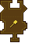

---
navigation:
  title: "Dig Widget"
  icon: "pneumaticcraft:textures/progwidgets/dig_piece.png"
  parent: pneumaticcraft:widget_interact.md
---

# Dig Widget

The [Drone](../tools/drone.md) will dig/mine the blocks within the specified [Area](./area.md). Items that are dropped from the blocks will not be picked up by the *Drone*. The order in which the blocks will be dug is similar to the [Place](./place.md) widget. Also in common with the *Place* widget, you can control if the area should be dug layer by layer (top to bottom or bottom to top).

## Using Tools

You can make the *Drone* [import](./inventory_import.md) a pickaxe/shovel/etc. to make it use that tool. When the *Drone* carries around multiple tools, the most suitable tool is automatically used for the block being dug.

You can prevent the Drone from trying to dig without a tool (which is really slow) by checking the *Requires digging tool* checkbox.

## Limiting the Dig Count

The amount of dig actions can be limited to a specified number by checking the *Limit block interactions* checkbox in the GUI, and setting a limit. E.g. if set to 1, the *Drone* will only dig one block (regardless of how many blocks are in the area), before moving to the next widget in the program. This can be used to only dig a few blocks and then check the durability of a tool, to repair it before it breaks.

## Filtering Blocks

Lastly you can specify which blocks may be mined by using an [Item Filter](./item_filter.md).

When used with blocks like crops, filter by the item that you would get when you break the crop (so *Seeds* for a *Wheat* crop). The exception would be blocks that *never* drop an item (even with Silk Touch), for which there is specific *Match by block* option in the filter setup GUI.

*Hi ho*

