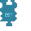

---
navigation:
  title: "Drone Condition: Item Widget"
  icon: "pneumaticcraft:textures/progwidgets/condition_drone_inventory_piece.png"
  parent: pneumaticcraft:widget_cond.md
---

# Drone Condition: Item Widget

The *Drone Condition: Item* widget allows you to check the inventory of this [Drone](../drone.md) for a certain amount of items. It will count up all matching items (specified by a connected [Item Filter](./item_filter.md), or no filter to count every item).

*Drone Condition: Item Widget*

