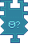

---
navigation:
  title: "Drone Condition: Fluid Widget"
  icon: "pneumaticcraft:textures/progwidgets/condition_drone_liquid_piece.png"
  parent: pneumaticcraft:widget_cond.md
---

# Drone Condition: Fluid Widget

This is a [Condition](./conditions.md) widget.

The *Drone Condition: Fluid* widget allows you to check the tank of this [Drone](../drone.md) for a certain amount of fluid. It will only count the fluid that's allowed by a connected [Fluid Filter](./liquid_filter.md) (or no filter to count any fluid).

*Drone Condition: Fluid Widget*

