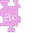

---
navigation:
  title: "Drop Item Widget"
  icon: "pneumaticcraft:textures/progwidgets/item_drop_piece.png"
  parent: pneumaticcraft:widget_interact.md
---

# Drop Item Widget

This will make the [Drone](../drone.md) drop items from its inventory in the connected [Area](./area.md). By *right-clicking* the *Drop Item* widget you can specify how many items per position in the area may be dropped. You can also toggle between *Random* and *Straight* modes, which mean it will drop the item with a small random offset (like a vanilla *Dropper)*, or drop the item straight down, respectively.

You can also connect an [Item Filter](./item_filter.md). With a filter, only items that are allowed by the filter will be dropped.

The widget is done executing when none of the applicable items remain in the *Drone's* inventory or when the *Drone* has visited every position in the area.

*Drop Item Widget*

