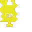

---
navigation:
  title: "Right Click Entity Widget"
  icon: "pneumaticcraft:textures/progwidgets/entity_right_click_piece.png"
  parent: pneumaticcraft:widget_interact.md
---

# Right Click Entity Widget

The [Drone](../drone.md) will *right-click* the item in its first inventory slot, for every entity in the specified [Area](./area.md), once. This could be used to shear sheep, milk cows, breed animals, and much more!

Keep in mind that any [Area](./area.md) widgets connected to this widget must have an area type of *Box*; this is the only supported shape. It's possible to create different shapes, though, by using whitelisting/blacklisting of areas.

*Poke*

