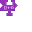

---
navigation:
  title: "External Program Widget"
  icon: "pneumaticcraft:textures/progwidgets/external_program_piece.png"
  parent: pneumaticcraft:widget_flow.md
---

# External Program Widget

This widget will search for any inventory in the specified [Area](./area.md). For every inventory, it will go through each slot. When a [Drone](../drone.md) or [Network API](../network_components.md#network_api) is found, it will run the program stored on that item.

When the program finishes, the *Drone* will move onto the next slot and/or inventory.

This widget can be used to debug *Drone* programs, as [Programmers](./programmer.md) also count as an inventory. Just program a *Drone* with the *External Program* widget with an area of (only) the *Programmer*, and place it down.

Now put a *Drone* or *Network API* in the programmer, and create your program. When you hit the *⟶ (export)* button in the *Programmer*, the deployed *Drone* will immediately execute your program.

*Programception*

