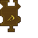

---
navigation:
  title: "Harvest Widget"
  icon: "pneumaticcraft:textures/progwidgets/harvest_piece.png"
  parent: pneumaticcraft:widget_interact.md
---

# Harvest Widget

The Drone will harvest any fully grown crop or tree within the specified [area](./area.md). Items that are dropped from the crop blocks are *not* picked up; either add a separate [Pick Up Item](./pickup_item.md) widget, or use some alternate means of collecting the items, such as a separate *Drone*.

You can connect an optional [Item Filter](./item_filter.md) to limit which crops will be harvested (use the crop's seed to filter).

## Tools

You can make the *Drone*  [import](./inventory_import.md) a *Hoe*. When equipped with a Hoe, crops will automatically be replanted (this uses durability from the Hoe).

You can force the *Drone* to *only* harvest when carrying a Hoe by checking the *Requires Hoe* checkbox in the widget setup GUI; then, if/when the Hoe breaks, the drone can get another one before continuing to harvest.

## Limiting Blocks Harvested

The amount of harvest actions can be limited to a specified amount by *right-clicking* the *Harvest* widget.

If set to 1 for example, the *Drone* will only harvest one block each time the widget is executed, and move on to the next widget after harvesting that one block.

*Get off my land*

