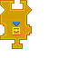

---
navigation:
  title: "Inventory Export Widget"
  icon: "pneumaticcraft:textures/progwidgets/inventory_export_piece.png"
  parent: pneumaticcraft:widget_interact.md
---

# Inventory Export Widget

The opposite of the [Inventory Import](./inventory_import.md) widget: the [Drone](../drone.md) will move to the nearest inventory within the specified [area](./area.md) to drop off items from the *Drone's* inventory.

*Right-click* the widget for a setup GUI where you can specify the sides of the inventory the Drone should export items to. You can also specify a maximum number of items to export.

You can also connect any number (including zero) of [Item Filter](./item_filter.md) widgets to limit the items that may be exported. Remember, filters on the *right* acts as a whitelist, and filters on the *left* act as a blacklist.

This widget is done executing when the *Drone's* inventory is empty, or when there's no inventory (or inventories) in the area which can accepts the items to be exported.

*You're welcome*

