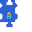

---
navigation:
  title: "Inventory Import Widget"
  icon: "pneumaticcraft:textures/progwidgets/inventory_import_piece.png"
  parent: pneumaticcraft:widget_interact.md
---

# Inventory Import Widget

This will make the [Drone](../tools/drone.md) move to the nearest inventory within the specified [area](./area.md), extract items from that inventory and insert them into the *Drone's* inventory.

*Right-click* the widget for a setup GUI where you can specify the side the *Drone* should extract the items from. You can also specify the maximum number of items to import.

You can also connect any number (including zero) of [Item Filter](./item_filter.md) widgets to limit the items that may be imported. Remember, filters on the *right* acts as a whitelist, and filters on the *left* act as a blacklist.

This widget is done executing when the *Drone's* inventory is full, or when no more (applicable) items can be found in the relevant inventory (or inventories).

*I'll have that, thanks*

