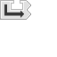

---
navigation:
  title: "Jump Widget"
  icon: "pneumaticcraft:textures/progwidgets/jump_piece.png"
  parent: pneumaticcraft:widget_flow.md
---

# Jump Widget

This widget is purely focused on [program flow](./flow_control.md). When the program hits a *Jump* widget, it will look at the connected [Text](./text.md) widget, and try to jump to a [Label](./label.md) widget with a matching name. If it fails for any reason, execution will return to the [Start](./start.md) widget. (This fallback behaviour should never occur normally).

A *Jump* widget can be used to merge multiple *branches* in the program flow (by using two or more jumps that all jump to the same [Label](./label.md), or simply to organize your program by separating sections into their own 'subroutines'. A useful tip is to check **Show Flow** checkbox at the bottom left of the [Programmer](./programmer.md) GUI;  it will show lines linking *Jump/Condition/Label* widgets of the same name.

*Might as well*

