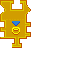

---
navigation:
  title: 'Fluid Export Widget'
  icon: 'pneumaticcraft:textures/progwidgets/liquid_export_piece.png'
  parent: pneumaticcraft:widget_interact.md
---

# Fluid Export Widget

The opposite of [Fluid Import](./liquid_import.md): the [Drone](../tools/drone.md) will move to the nearest tank within the specified [Area](./area.md) to drop off fluid from its own tank.

Additionally, the _Drone_ can place fluid in the world: to do so, check the _Place fluid in world_ option in the widget GUI. Beware, _Drones_ can easily trap themselves while doing this!

You can specify to which side(s) of the tank the Drone should output its items in the widget GUI; you can also specify a maximum amount of exported fluid (in mB).

You can <Color id='dark_purple'>$(t:Connect on the right to whitelist, on the left to blacklist)connect$(/t:Connect on the right to whitelist, on the left to blacklist)</Color> a [Fluid Filter](./liquid_filter.md) to limit what may be exported by the Drone.

This widget is done when the _Drone's_ tank is empty (of applicable fluids), or when there's no tank within the area which will accepts the fluid.

_Fluid Export Widget_

