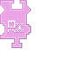

---
navigation:
  title: "Pick Up Items Widget"
  icon: "pneumaticcraft:textures/progwidgets/item_pick_piece.png"
  parent: pneumaticcraft:widget_interact.md
---

# Pick Up Items Widget

The [Drone](../tools/drone.md) will pick up item entities in the world and put them into its inventory. Keep in mind that any [Area](./area.md) widgets connected to this widget must have an area type of *Box*; this is only supported shape. It's possible to create more complex shapes, though, by using whitelisting/blacklisting of multiple areas.

You can add an [Item Filter](./item_filter.md) widget to limit which items can be picked up (remember, a blacklist filter is placed on the *left*).

This widget is done executing when no items lying on the ground (which pass the item filter) can fit in the Drone's inventory or when there are no items left to pick up.

*Mine. Mine. Mine.*

