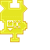

---
navigation:
  title: "Place Widget"
  icon: "pneumaticcraft:textures/progwidgets/place_piece.png"
  parent: pneumaticcraft:widget_interact.md
---

# Place Widget

The [Drone](../drone.md) will place blocks from its inventory in the world. It will place blocks in the [area](./area.md) specified, starting with locations that are closest to it.

You can control the order in which blocks are placed: *Right-click* the widget to specify if the *Drone* should place blocks layer by layer, and if so from top to bottom or vice versa.

## Placing Random Blocks

Normally, the *Drone* will place blocks from its inventory in order, starting from the first slot (bear in mind that drone inventories only have a single slot by default, but [Inventory Upgrades](../upgrades.md#inventory) can be used to increase that).

By checking the *Place Random Blocks* option, the *Drone* will select blocks at random from its inventory to place.

## Limiting the Place Count

The number of place actions can be limited to a specified amount by *right-clicking* the widget. If set to 1 for example, the *Drone* will only place one block, and the widget is considered done after placing that one block.

If no limit is set, the widget is only considered done when unable to place any more blocks.

## Filtering

Finally, you can specify which blocks from the *Drone's* inventory may be placed by connecting an [Item Filter](./item_filter.md) widget. Connect on the *right* to whitelist items, and on the *left* to blacklist items.

*Place Widget*

