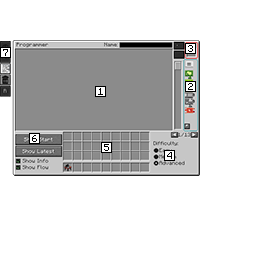

---
navigation:
  title: "Programmer"
  icon: "pneumaticcraft:programmer"
  parent: pneumaticcraft:programming.md
item_ids:
  - pneumaticcraft:programmer
---

# Programmer

The *Programmer* is a machine used to program [Drones](../drone.md), using a visual programming system where [Puzzle Pieces](./puzzle_pieces.md) are assembled in a programming GUI. The *Programmer* does not require [pressure](../pressure.md) to operate.The rest of the *Programming* category has much more information about how to write Drone programs.

Crafting a Programmer

<Recipe id="pneumaticcraft:programmer" />

*Programmer GUI: see following pages for information on each section*

**1. Main Programming Area**

This area is where your actual actual program is built. Widgets are dragged here from the *widget tray (area 2)* and 'snapped' together to form programs.

You can zoom in and out of the programming area with the mouse wheel, or with the scrollbar on the right-hand side.

**2. Widget Tray**

This area holds the widgets you will use to build your program. It holds more widgets than are shown; you can cycle through pages with the arrow buttons under the tray, or expand the tray to show all widgets with *Space* or *Tab*.

When expanded, the tray will also show a textfield above where you can enter a filter string to search for widgets.

**3. Drone Slot**

Place the [Drone](../drone.md) (or [Network Storage/API](../network_components.md)) to be programmed here. When ready to program the Drone, press the *⟶* button to write the program. You can use the textfield to the left to name the Drone, if you wish. You will hear audible feedback if successful.

You can also use the *⟵* button to import a program from a Drone (or Network Storage/API).

**4. Difficulty Selection**

These radio buttons control which of the programming widgets are available in the tray. They also enable/disable some advanced features, such as [variables](./coordinate_operator.md).

**5. Player Inventory**

Your own inventory; if you have any [GPS Tools](../gps_tool.md) or [GPS Area Tools](../gps_area_tool.md), you can click them on [Area](./area.md) or [Coordinate](./coordinate.md) widgets to transfer their settings to the widget.

**6. Navigation & Display Options**

You can use these buttons to:
- Navigate to the [Start](./start.md) widget of your program
- Navigate to the last widget you placed
- Toggle display of extra info on each widget
- Toggle display of connection lines between [Jump](./jump.md) and [Label](./label.md) widgets

**7. Misc Buttons**

The buttons along the left-hand edge of the GUI allow (in order):
- *Undo* of up to the last 20 actions
- *Redo* of the previous undo
- *Import or Export* your program as a JSON file to [pastebin.com](https://pastebin.com) (Pastebin login optional)
- *Delete* your entire program (can be undone)
- *Convert* your program to *Relative* co-ordinates (see [this page](#convert_relative) for more information)

## Progwidget IDs

If you toggle on extended tooltip information with *F3+H*, you will notice that the tooltip for each programming widget also includes the internal widget ID at the end. This is primarily of benefit if you intend to do any drone programming with the [Drone Interface](../drone_interface.md) - the *setAction()* Lua method in the Drone Interface takes these IDs (the *pneumaticcraft:* prefix is optional) as a parameter.

## Sharing Programs

If you want to share your programs with other players, you have a couple of options:
- You can use the *Pastebin* button to export your program to [pastebin.com](https://pastebin.com)
- The *Pastebin* GUI also allows writing the program to the clipboard for copying & pasting
- You can save your program to a [Drone](../drone.md) or [Network Storage/Network API](../network_components.md) and give the item to another player on your server.

## Convert to Relative

Say you've designed a program that runs an automated farm and you want to share this. People on a different world will have their farm at different coordinates, so they would have to change every single [Area](./area.md) widget; what a pain.

The *Convert to Relative* button makes this easier; it also provides tooltips indicating what you need to do to convert your program.

## Convert to Relative (cont.)

You will need to add one fixed [Coordinate Operator](./coordinate_operator.md) widget, along with a [Coordinate](./coordinate.md) widget containing a *base position* (e.g. the position of an input chest). It then converts any absolute positions (area or coordinate) used in your program to coordinates relative to that base position.

Now, users of your program will only have to adjust a single coordinate to use your program!

## JEI Integration

If JEI is installed, you will notice a '+' (Move Items) button if you open the JEI recipe display while the Programmer GUI is open. Clicking it will add [Item Filter](./item_filter.md) widgets for each input item in the recipe. If you have a [Crafting](./crafting.md) widget in the programming area with no Item Filters attached, Item Filters will be added to the Crafting Widget to quickly & easily set up a recipe. Otherwise, they will be added in a row at the top left of the programming area.

## JEI Integration (cont)

By default, only one Item Filter is added for each unique item type (e.g. for a *Stone Slab* recipe, only one *Stone* filter will be created, not three). Remember that widgets can be copied by middle-clicking and dragging. If you want to add an Item Filter for every item in the recipe, including duplicates, hold Shift when clicking the '+' button in JEI.

