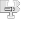

---
navigation:
  title: "Rename Widget"
  icon: "pneumaticcraft:textures/progwidgets/rename_piece.png"
  parent: pneumaticcraft:widget_other.md
---

# Rename Widget

This widget renames the [Drone](../drone.md), as if you had *right-clicked* it with a *Name Tag*. The name is entered in the attached [Text](./text.md) widget.

## Variables

You can also insert the value of a [variable](./variables.md), by including *${<var_name>}* in the text, e.g.

  <Color hex="#272">Counter: ${counter}</Color>

would expand to *Counter: 1, 2, 3* if the *counter* variable was set to *x=1,y=2,z=3*. [Special](./variables.md#special) and [Global variables](./variables.md#global) can also be used here.

*Who are you again?*

