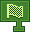

---
navigation:
  title: "Start Widget"
  icon: "pneumaticcraft:textures/progwidgets/start_piece.png"
  parent: pneumaticcraft:widget_flow.md
---

# Start Widget

The *Start* widget is the first widget in your program, and is where [program execution](./flow_control.md) starts.

It *must* exist, and there can be only one.

*Call me MacLeod*

