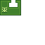

---
navigation:
  title: "Suicide Widget"
  icon: "pneumaticcraft:textures/progwidgets/suicide_piece.png"
  parent: pneumaticcraft:widget_flow.md
---

# Suicide Widget

The [Drone](../drone.md) will immediately turn into its item form, dropping as an item entity on the ground. Program execution is, of course, instantly terminated.

*That's all, folks*

