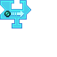

---
navigation:
  title: "Teleport Widget"
  icon: "pneumaticcraft:textures/progwidgets/teleport_piece.png"
  parent: pneumaticcraft:widget_interact.md
---

# Teleport Widget

*Teleport* is the more expensive (in terms of [air](../pressure.md) used) version of the [Goto](./goto.md) widget, but just as straightforward: the [Drone](../drone.md) will teleport to the nearest reachable location within the specified [Area](./area.md).

The *Drone* uses 10000mL air to teleport, which is most of an un-upgraded *Drone's* capacity, so [Volume Upgrades](../upgrades.md#volume) are recommended.

*Now I'm here. Now I'm there.*

