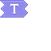

---
navigation:
  title: "Text Widget"
  icon: "pneumaticcraft:textures/progwidgets/text_piece.png"
  parent: pneumaticcraft:widget_other.md
---

# Text Widget

The *Text* widget is only used as a parameter for other widgets. It is used to provide textual data for those widgets that need it.

The following pages list those widgets that use it.

## As Entity Filters

- [TODO](./entity_attack.md)
- [TODO](./entity_right_click.md)
- [TODO](./entity_import.md)
- [TODO](./entity_export.md)
- [TODO](./drone_condition_entity.md)

You can place the *Text* widget on the *left* of these widgets to create a blacklist filter.

## For Other Widgets

- [TODO](./edit_sign.md)
- [TODO](./rename.md)
- [TODO](./jump.md)
- [TODO](./label.md)
- [TODO](./wait.md)
- [TODO](./conditions.md)

*Text Widget*

