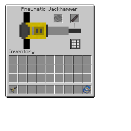

---
navigation:
  title: "Pneumatic Jackhammer"
  icon: "pneumaticcraft:jackhammer[pneumaticcraft:air=120000]"
  parent: pneumaticcraft:tools.md
item_ids:
  - pneumaticcraft:jackhammer
---

# Pneumatic Jackhammer

<ItemImage id="pneumaticcraft:jackhammer" />

The *Pneumatic Jackhammer* is a highly versatile mining tool, which can break all types of block equally effectively, using [pressure](../pressure.md) to do so. Its mining speed and air capacity can be upgraded in a [Charging Station](../charging_station.md) with [Speed Upgrades](../upgrades.md#speed) and [Volume Upgrades](../upgrades.md#volume), respectively.

## Drill Bits

A newly-crafted Jackhammer comes without a *Drill Bit*, so isn't very useful. You will need to insert one; right-click the Jackhammer to open its configuration GUI, and place a bit in the top-right slot.

There are four types of Drill Bit, in ascending power and cost:
- Iron
- Compressed Iron
- Diamond
- Netherite

## Dig Modes

The Jackhammer supports several dig modes, including some *veinminer* functionality, making it very easy to dig out large areas quickly. The dig modes supported depend on the *Drill Bit* you're using; better bits support more dig modes (in addition to improved dig speed).

To set a dig mode, open the Jackhammer GUI (right-click) and use the button in the lower right (see opposite).

*Jackhammer GUI with a Netherite Drill Bit installed and 3x3 dig mode selected*



## Enchanting

<ItemImage id="minecraft:enchanted_book" />

The Jackhammer cannot be enchanted normally in an *Enchanting Table*, but it is possible to insert a *Silk Touch* or *Fortune* enchanted book, via the GUI. A book placed in the book slot (top center) will bestow its enchantment on the Jackhammer.

## Enchanting (cont.)

This has the advantage of being easily swappable between a Silk Touch and a Fortune book, as you need.

If you're finding it difficult to obtain the books you need (vanilla book enchanting being so very random), bear in mind that the [Pressure Chamber](../pressure_chamber.md) is able to strip enchantments from tools and place them on books.

Crafting a Jackhammer

<Recipe id="pneumaticcraft:jackhammer" />

**TODO:** Unsupported Patchouli page type **pneumaticcraft:thermo_plant**

```
{"type":"pneumaticcraft:thermo_plant","recipe":"pneumaticcraft:thermo_plant/iron_drill_bit"}
```

**TODO:** Unsupported Patchouli page type **pneumaticcraft:thermo_plant**

```
{"type":"pneumaticcraft:thermo_plant","recipe":"pneumaticcraft:thermo_plant/compressed_iron_drill_bit"}
```

**TODO:** Unsupported Patchouli page type **pneumaticcraft:thermo_plant**

```
{"type":"pneumaticcraft:thermo_plant","recipe":"pneumaticcraft:thermo_plant/diamond_drill_bit"}
```

**TODO:** Unsupported Patchouli page type **pneumaticcraft:assembly_system**

```
{"type":"pneumaticcraft:assembly_system","recipe":"pneumaticcraft:assembly/netherite_drill_bit"}
```

