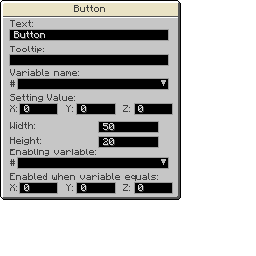

---
navigation:
  title: "Remote"
  icon: "pneumaticcraft:remote"
  parent: pneumaticcraft:tools.md
item_ids:
  - pneumaticcraft:remote
---

# Remote

With a Remote you can create your own GUI to remotely control [Drones](./drone.md) or [Universal Sensors](../universal_sensor.md) via [global variable](../variables.md#global) manipulation. Note that with *Universal Sensors*, you can use the *Remote* to create wireless redstone!

To start creating your own GUI, *sneak+right-click* the *Remote* to open up the editor window.

Filling in the window works similarly to how programming in a [Programmer](../programmer.md) works; simply click and drag widgets from the right-hand panel into the main panel on the left.

To copy a widget, *middle-click* and drag an existing widget. To edit the properties of a widget, *right-click* the widget. For example, for a button, this will open up the following window:

In this window you can configure how the button should look and behave.

The following properties are common to *all* widgets:
- *Text* - the displayed text on the widget
- *Tooltip* - tooltip displayed when hovering over that widget
- *Enabling Variable* - you can control whether or not the widget is shown by linking it to a [variable](../coordinate_operator.md). By giving the X/Y/Z fields a value, you can ensure that the widget is only shown if the linked variable is equal to the values you specify.

## Label Widget

This widget simply displays some text, with an optional tooltip, for informational purposes. While the label can't *change* variables, it can *display* a variable, using the syntax *${#globalvarname}*, which can be useful for debugging purposes.

The Label widget has no fields other than the default fields.

## Button Widget

The Button widget sets the value of the linked variable when pressed.
- *Variable Name* - the linked [global variable](../variables.md#global).
- *Setting Value* - the X/Y/Z values to assign to the linked variable when the button is pressed.
- *Width/Height* - dimensions of the button.

## Checkbox Widget

The Checkbox widget sets the X value of the linked variable to 1 when checked, and to 0 otherwise.
- *Variable Name* - the linked [global variable](../variables.md#global).

## Dropdown Widget

The Dropdown widget sets the X value of the linked variable to the index of the selected element.
- *Drop-down Elements* - a comma-separated list of text labels.
- *Variable Name* - the linked [global variable](../variables.md#global).
- *Sorted* - if checked, the elements in the list will be alphabetically sorted. Otherwise, the elements will appear in the order you provided.

## Example

Using the *Pastebin* button at the left of the Editor GUI, import [this layout](https://pastebin.com/4yxKG5Jc).

This adds three checkboxes, setting global variables *signal1, signal2 & signal3*.

Now place down three [Universal Sensors](../universal_sensor.md), and give them some pressure. Put a [Dispenser Upgrade](../upgrades.md#dispenser) in each *Sensor*. Run some redstone from each *Sensor* (place them a block apart to keep the redstone separate).

## Example (cont.)

In each *Sensor* GUI:
- Select the *Dispenser* button
- Select *World*
- Select *Global Variable*
- In the *Variable Name* textfield, enter 'signal1', 'signal2' & 'signal3' respectively.

Now, *right-click* your *Remote*, and try selecting/deselecting each checkbox. The corresponding *Sensor* will emit a redstone signal as appropriate: wireless redstone!

Crafting a Remote

<Recipe id="pneumaticcraft:remote" />

