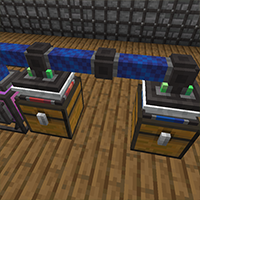

---
navigation:
  title: "Logistics Module"
  icon: "pneumaticcraft:logistics_module"
  parent: pneumaticcraft:tubes.md
item_ids:
  - pneumaticcraft:logistics_module
---

# Logistics Module

This powerful module is used to connect inventories to a [Logistics System](../overview.md), effectively allowing controlled item and fluid transfer via pressure tubes.

The inventory or fluid tank that the module points at must be fitted with a [Logistics Frame](../frames.md).

The Logistics Module does not accept an [Module Expansion Card](./module_expansion_card.md).

Two Logistics Modules connecting chests with [Passive Provider](../frames.md#passive_provider) and [Requester](../frames.md#requester) Frames.

TODO: Unsupported flag 'border'

A network of Logistics Modules is defined by all the modules connected to each other by [Pressure Tubes](./pressure_tubes.md); note that any air-using machines do *not* form part of the network.

You can select a channel via the module GUI, or by right-clicking with any *dye*; only Logistics Modules of the same color will communicate with each other, effectively giving you 16 *channels* on each network.

Logistics Modules need [pressure](../pressure.md); 3 bar is required to let the modules operate. The air used is a multiplication of distance, amount transported and a constant. This means that it requires more air to transport a full stack of items, and also more to transport it a long way. The air is used at the *receiving* Logistics Module, since the air is flowing towards that module.

Indicator lights are fitted to signify the status:

- <Color hex="#f00">Red</Color>: Not enough pressure, apply at least 3 bar.
- <Color hex="#f80">Orange</Color>: More than 3 bar, but not enough pressure to transport the items/fluids this distance.
- <Color hex="#0f0">Green</Color>: Enough pressure, on standby.
- <Color hex="#00f">Blue (pulse)</Color>: Items/fluids are being transported.

Crafting a Logistics Module

<Recipe id="pneumaticcraft:logistics_module" />

