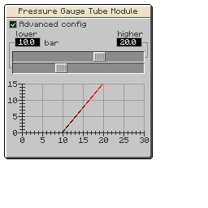

---
navigation:
  title: "Pressure Gauge Module"
  icon: "pneumaticcraft:pressure_gauge_module"
  parent: pneumaticcraft:tubes.md
item_ids:
  - pneumaticcraft:pressure_gauge_module
---

# Pressure Gauge Module

This tube module shows the [pressure](../base_concepts/pressure.md) currently in the tube it's attached to. It also emits a (directional) <Color hex="#f00">redstone signal</Color> of which the strength equals:

<Color hex="#272">  strength = 2 x pressure</Color>

E.g. a pressure of 3.5 bar results in a redstone signal level of 7.

<ItemImage id="pneumaticcraft:module_expansion_card" />

Applying a [Module Expansion Card](./module_expansion_card.md) to the Pressure Gauge Module unlocks a GUI (right-click) to provide much more control over <Color hex="#f00">redstone signal</Color> emission. By default, you can provide a threshold level: the signal will be off below that level and fully on above it (or vice versa). If you select the **Advanced Config** toggle in the GUI, you gain even more control (see over).

*<10 bar = 0 redstone, >20 bar = 15 redstone, 10-20 bar = interpolate (e.g. 12 bar = 3 redstone)*

Crafting a Pressure Gauge Module

<Recipe id="pneumaticcraft:pressure_gauge_module" />

