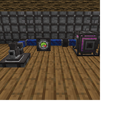

---
navigation:
  title: "Pressure Tubes"
  icon: "pneumaticcraft:pressure_tube"
  parent: pneumaticcraft:tubes.md
item_ids:
  - pneumaticcraft:pressure_tube
---

# Pressure Tubes

Pressure Tubes are the primary device in <Color hex="#228">PneumaticCraft: Repressurized</Color> for transporting compressed air between compressors and machines.

Unconnected tubes will leak air! However, the sides of a tube can be toggled open or shut by right-clicking with a [Pneumatic Wrench](../tools/pneumatic_wrench.md). Wrenches from other mods may also work.

## Tubes!

*Two Pressure Tubes with a [Pressure Gauge](./pressure_gauge_module.md)* *connecting an [Air Compressor](../compressors/air_compressor.md)* *and [Air Cannon](../machines/air_cannon.md)*

TODO: Unsupported flag 'border'


Pressure Tubes can be fitted with [Tube Modules](./tube_modules.md), attachable components which add various types of functionality to the tube. See the individual pages for each module for more information.

Pressure Tubes can be concealed with a [Camouflage Applicator](../tools/camo_applicator.md).

There are three [tiers](../base_concepts/pressure_tiers.md) of tube:

- Tier 1 tubes can contain up to 5 bar of pressure, and have a capacity of 1000mL of air.
- Tier 1.5 (Reinforced) tubes can handle up to 10 bar of pressure and also have a capacity of 1000mL.
- Tier 2 (Advanced) tubes can handle up to 20 bar of pressure and have a capacity of 4000mL of air.

Crafting a Pressure Tube

<Recipe id="pneumaticcraft:pressure_tube" />

**TODO:** Unsupported Patchouli page type **pneumaticcraft:thermo_plant**

```
{"type":"pneumaticcraft:thermo_plant","recipe":"pneumaticcraft:thermo_plant/reinforced_pressure_tube"}
```

<a name="advanced"></a>
**TODO:** Unsupported Patchouli page type **pneumaticcraft:assembly_system**

```
{"anchor":"advanced","type":"pneumaticcraft:assembly_system","recipe":"pneumaticcraft:assembly/advanced_pressure_tube"}
```

