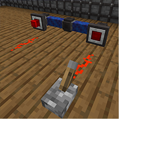

---
navigation:
  title: "Redstone Module"
  icon: "pneumaticcraft:redstone_module"
  parent: pneumaticcraft:tubes.md
item_ids:
  - pneumaticcraft:redstone_module
---

# Redstone Module

This module exchanges <Color hex="#f00">redstone signals</Color> with other Redstone Modules on connected tubes, effectively using the tube as a redstone conduit.

Up to 16 independent channels can be selected via the module GUI, or by right-clicking the module with any *Dye*.

Right-click the module with a *wrench* to toggle it between input and output mode.

TODO: Unsupported flag 'border'

<ItemImage id="pneumaticcraft:module_expansion_card" />

When you apply an [Module Expansion Card](./module_expansion_card.md) to the module, extra signal processing will be available. When the module is in *output mode*, you can right-click the module to open a GUI and choose a mode to apply to the output signal, e.g. invert the signal, AND/OR/XOR it with another channel...

The effect of each mode is described in detail in the module GUI.

Crafting a Redstone Module

<Recipe id="pneumaticcraft:redstone_module" />

