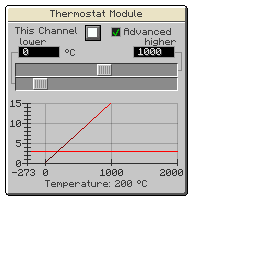

---
navigation:
  title: 'Thermostat Module'
  icon: 'pneumaticcraft:thermostat_module'
  parent: pneumaticcraft:tubes.md
item_ids:
  - pneumaticcraft:thermostat_module
---

# Thermostat Module

This tube module measures the temperature of the block it's facing and provides a redstone signal on the configured channel (use a [Redstone Module](./redstone_module.md) in output mode to emit the signal) if the temperature is higher than the set threshold.

<ItemImage id="pneumaticcraft:module_expansion_card" />

Applying a [Module Expansion Card](./module_expansion_card.md) to the Thermostat Module unlocks the advanced GUI to provide much more control over <Color id="red">redstone signal</Color> emission. By default, you can provide a threshold level: the signal will be off below that level and fully on above it (or vice versa). If you select the **Advanced Config** toggle in the GUI, you gain even more control (see over).

_\<0°C = 0 redstone, \>1000°C = 15 redstone, 0-1000°C = interpolate (e.g. 200°C = 3 redstone)_

Crafting a Thermostat Module

<Recipe id="pneumaticcraft:thermostat_module" />
