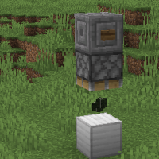

---
navigation:
  title: "Nori"
  icon: "sushigocrafting:nori_sheets"
  position: 2
  parent: sushigocrafting:getting_started.md
---

# Nori

To get Nori Sheets you will need to find some Kelp in the oceans and make a Dried Kelp Block with it. 

Squishing a Dried Kelp Block (dropped as an item) between an Iron Block with a piston will get you some Nori Sheets.

## Nori Piston Crafting

